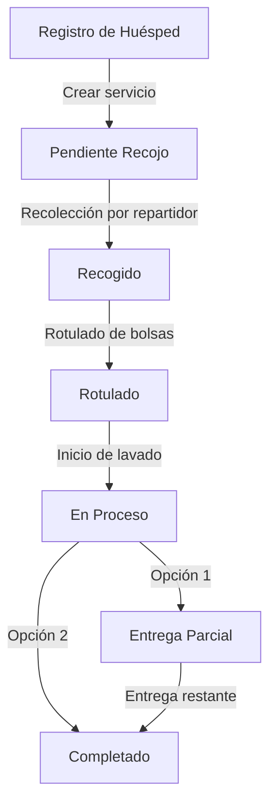
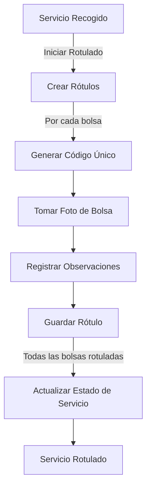
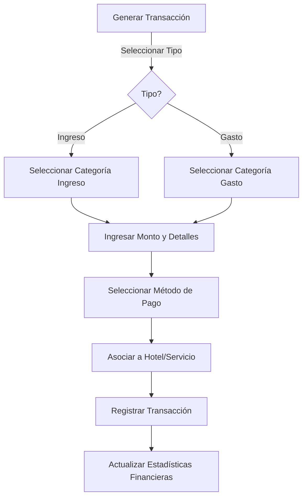

# 🧺 FUMY LIMP - LÓGICA DE NEGOCIO

## 📋 Resumen Ejecutivo

Fumy Limp es un sistema completo de gestión para lavandería industrial especializada en servicios hoteleros en Lima, Perú. La aplicación maneja todo el ciclo de vida de los servicios de lavandería, desde el registro de huéspedes y entrega de bolsas, hasta el procesamiento, rotulado y entrega final de la ropa limpia. 

El negocio opera con un modelo B2B (Business-to-Business), donde sus clientes principales son hoteles de categoría premium con los que mantiene contratos formales. La empresa cobra por kilogramo de ropa procesada, con precios diferenciados según cada hotel cliente.

Fumy Limp gestiona toda la cadena de valor:
1. Registro de huéspedes en hoteles
2. Entrega y control de inventario de bolsas 
3. Recojo de bolsas por repartidores asignados por zonas
4. Procesamiento en planta (rotulado, lavado, planchado)
5. Entrega parcial o total del servicio
6. Gestión financiera y reportes analíticos

El sistema está optimizado para tablets y dispositivos móviles utilizados por repartidores en campo, e incluye funcionalidades clave como captura de firmas digitales, toma de fotos, cálculo automático de precios y rotulado con seguimiento.

---

## 🔄 Análisis de Entidades

### 1. Usuarios (Users)

| Campo | Tipo | Descripción | Validaciones |
|-------|------|-------------|--------------|
| id | String | Identificador único | Generado automáticamente |
| name | String | Nombre completo | Requerido, entre 5-100 caracteres |
| email | String | Correo electrónico | Requerido, formato email válido, único |
| role | Enum | Rol del usuario | Valores permitidos: "admin", "repartidor" |
| zone | String | Zona geográfica asignada | Requerido para repartidores |
| phone | String | Número de teléfono | Formato numérico, 9 dígitos |
| password | String | Contraseña | Mínimo 8 caracteres, no se almacena en texto plano |

#### Reglas de negocio:
- Los usuarios administradores tienen acceso completo al sistema
- Los repartidores solo pueden ver y gestionar servicios de su zona geográfica
- Cada zona debe tener al menos un repartidor asignado
- La contraseña se almacena de forma segura (en un sistema real)
- El email debe ser único en el sistema

### 2. Hoteles (Hotels)

| Campo | Tipo | Descripción | Validaciones |
|-------|------|-------------|--------------|
| id | String | Identificador único | Generado automáticamente |
| name | String | Nombre del hotel | Requerido, único |
| address | String | Dirección física | Requerido |
| zone | String | Zona geográfica | Requerido, debe coincidir con zonas definidas |
| contactPerson | String | Nombre del contacto | Requerido |
| phone | String | Teléfono de contacto | Requerido, formato numérico |
| email | String | Email de contacto | Formato email válido |
| bagInventory | Number | Cantidad de bolsas disponibles | Entero positivo, mínimo 0 |
| pricePerKg | Number | Precio por kg de ropa | Número positivo con 2 decimales |

#### Reglas de negocio:
- Cada hotel tiene un precio diferenciado por kilogramo
- El inventario de bolsas se reduce automáticamente al entregar bolsas
- Se generan alertas cuando el inventario está por debajo del umbral (20% de capacidad)
- Los hoteles se agrupan por zonas geográficas para asignación de repartidores
- La modificación de precios solo puede ser realizada por administradores

### 3. Servicios (Services)

| Campo | Tipo | Descripción | Validaciones |
|-------|------|-------------|--------------|
| id | String | Identificador único | Generado automáticamente |
| guestName | String | Nombre del huésped | Requerido, entre 3-100 caracteres |
| roomNumber | String | Número de habitación | Requerido |
| hotel | String | Nombre del hotel | Requerido, debe existir |
| hotelId | String | ID del hotel | Requerido, debe existir |
| bagCount | Number | Cantidad de bolsas | Entero positivo, mínimo 1 |
| weight | Number | Peso en kg | Positivo con 1 decimal, requerido en estados post-recojo |
| observations | String | Observaciones generales | Opcional |
| specialInstructions | String | Instrucciones especiales | Opcional |
| priority | Enum | Prioridad del servicio | Valores: "alta", "media", "normal" |
| pickupDate | Date | Fecha real de recojo | Requerido en estados post-recojo |
| estimatedPickupDate | Date | Fecha estimada de recojo | Requerido al crear el servicio |
| labeledDate | Date | Fecha de rotulado | Requerido en estados post-rotulado |
| deliveryDate | Date | Fecha real de entrega | Requerido en estados completados |
| estimatedDeliveryDate | Date | Fecha estimada de entrega | Calculado automáticamente |
| status | Enum | Estado del servicio | Valores permitidos (ver flujo de estados) |
| photos | Array | Fotos del servicio | Formato base64, máximo 5 fotos |
| signature | String | Firma digital del cliente | Formato base64, requerido en recojo y entrega |
| collectorName | String | Nombre del recolector | Requerido en estados post-recojo |
| geolocation | Object | Ubicación del recojo | Latitud y longitud |
| repartidor | String | Nombre del repartidor | Asignado automáticamente por zona |
| repartidorId | String | ID del repartidor | Debe existir |
| partialDeliveryPercentage | Number | % de entrega parcial | Entre 1-99% |
| price | Number | Precio calculado | Calculado automáticamente según peso y precio/kg |
| pickupTimeSlot | String | Franja horaria de recojo | Formato HH:mm - HH:mm |
| customerNotes | String | Notas del cliente | Opcional |
| internalNotes | String | Notas internas | Solo visible para empleados |
| timestamp | Date | Fecha de creación | Generado automáticamente |
| labelingPhotos | Array | Fotos de rotulado | Array de strings base64 |
| deliveryPhotos | Array | Fotos de entrega | Array de strings base64 |
| deliveredBagCount | Number | Bolsas entregadas | Entero positivo ≤ bagCount |
| remainingBags | Number | Bolsas pendientes | Calculado: bagCount - deliveredBagCount |

#### Reglas de negocio:
- Un servicio no puede tener peso registrado hasta ser recogido
- El precio se calcula automáticamente: peso × precio por kg del hotel
- Las fechas estimadas siguen reglas predefinidas (24h para recojo, 48h para entrega)
- El estado inicial es siempre "pendiente_recojo"
- La creación de un servicio reduce automáticamente el inventario de bolsas del hotel
- Un servicio no puede avanzar de estado sin cumplir los requisitos previos
- Los servicios con prioridad "alta" aparecen destacados en dashboards

### 4. Rótulos de Bolsas (BagLabels)

| Campo | Tipo | Descripción | Validaciones |
|-------|------|-------------|--------------|
| id | String | Identificador único | Generado automáticamente |
| serviceId | String | ID del servicio | Debe existir |
| hotelId | String | ID del hotel | Debe existir |
| hotelName | String | Nombre del hotel | Debe coincidir con el ID |
| label | String | Código del rótulo | Formato específico: HTL-YYYYMMDD-HHMM-NN-XXXX |
| bagNumber | Number | Número de bolsa | Entero positivo, único por servicio |
| photo | String | Foto del rótulo | Formato base64, requerido |
| registeredBy | String | ID de quien registra | Debe existir |
| registeredByName | String | Nombre de quien registra | Debe coincidir con el ID |
| timestamp | Date | Fecha de creación | Generado automáticamente |
| status | String | Estado del rótulo | Valores: "labeled", "processing", "completed" |
| generatedAt | String | Lugar de generación | Valores: "lavanderia", "hotel" |
| observations | String | Observaciones | Opcional |
| labeledAt | Date | Fecha de rotulado | Requerido cuando status="labeled" |
| updatedAt | Date | Fecha de actualización | Actualizado automáticamente |
| updatedBy | String | ID de quien actualiza | Opcional |
| updatedByName | String | Nombre de quien actualiza | Opcional |

#### Reglas de negocio:
- Cada servicio debe tener exactamente un rótulo por bolsa
- El formato del rótulo es estandarizado y único
- Cada rótulo debe tener una foto asociada para validación
- Los rótulos no pueden crearse sin un servicio en estado mínimo "recogido"
- Un rótulo no puede ser eliminado si el servicio ya está en proceso

### 5. Transacciones Financieras (Transactions)

| Campo | Tipo | Descripción | Validaciones |
|-------|------|-------------|--------------|
| id | String | Identificador único | Generado automáticamente |
| type | Enum | Tipo de transacción | Valores: "income", "expense" |
| amount | Number | Monto | Positivo con 2 decimales |
| category | String | Categoría | Valores predefinidos por tipo |
| description | String | Descripción | Requerido, mínimo 5 caracteres |
| date | Date | Fecha de transacción | Formato YYYY-MM-DD |
| paymentMethod | String | Método de pago | Valores predefinidos |
| hotelId | String | ID del hotel relacionado | Opcional, debe existir si se proporciona |
| hotelName | String | Nombre del hotel | Debe coincidir si existe hotelId |
| serviceId | String | ID del servicio relacionado | Opcional, debe existir si se proporciona |
| notes | String | Notas adicionales | Opcional |
| registeredBy | String | ID de quien registra | Debe existir |
| registeredByName | String | Nombre de quien registra | Debe coincidir con el ID |
| timestamp | Date | Fecha y hora de registro | Generado automáticamente |

#### Reglas de negocio:
- Las transacciones pueden ser de dos tipos: ingresos o gastos
- Las categorías están predefinidas para cada tipo de transacción
- Los servicios completados generan automáticamente transacciones de ingreso
- Solo administradores pueden registrar transacciones manuales
- Los métodos de pago permitidos son: "efectivo", "transferencia_bancaria", "yape", "plin", "tarjeta_credito", "tarjeta_debito"
- Las transacciones no pueden ser eliminadas, solo anuladas

### 6. Registro de Auditoría (AuditLog)

| Campo | Tipo | Descripción | Validaciones |
|-------|------|-------------|--------------|
| id | String | Identificador único | Generado automáticamente |
| action | String | Acción realizada | Valores predefinidos |
| entity | String | Entidad afectada | Valores: "service", "bag_label", "transaction", "user", "hotel", etc. |
| entityId | String | ID de la entidad | Debe existir |
| details | String | Detalles de la acción | Requerido |
| userId | String | ID del usuario | Debe existir |
| userName | String | Nombre del usuario | Debe coincidir con el ID |
| timestamp | Date | Fecha y hora | Generado automáticamente |

#### Reglas de negocio:
- Todas las acciones críticas generan automáticamente un registro de auditoría
- Los registros de auditoría no pueden modificarse o eliminarse
- Los registros incluyen información detallada para trazabilidad completa
- Los registros son solo visibles para administradores

---

## 🔄 Diagramas de Flujo de Trabajo y Estados

### Flujo Principal de Servicio



### Estados de Servicio Detallados

| Estado | Código | Descripción | Requisitos Previos | Acciones Permitidas |
|--------|--------|-------------|-------------------|---------------------|
| Pendiente Recojo | `PENDING_PICKUP` | Servicio registrado esperando recojo | Ninguno | Editar, Cancelar |
| Recogido | `PICKED_UP` | Bolsas recogidas y pesadas | `PENDING_PICKUP` | Rotular, Cancelar |
| Rotulado | `LABELED` | Todas las bolsas etiquetadas | `PICKED_UP` | Iniciar Proceso, Cancelar |
| En Proceso | `IN_PROCESS` | Servicio en planta de lavado | `LABELED` | Entrega Parcial, Completar |
| Entrega Parcial | `PARTIAL_DELIVERY` | Parte del servicio entregado | `IN_PROCESS` | Completar |
| Completado | `COMPLETED` | Servicio finalizado | `IN_PROCESS` o `PARTIAL_DELIVERY` | Ninguna |
| Cancelado | `CANCELLED` | Servicio cancelado | Cualquiera excepto `COMPLETED` | Ninguna |

### Diagrama de Flujo del Proceso de Rotulado



### Diagrama de Flujo de Transacciones Financieras



---

## 📏 Reglas de Negocio Detalladas

### 1. Registro de Huéspedes y Entrega de Bolsas

1. **Verificación de inventario**:
   - Al registrar un huésped, el sistema verifica que el hotel tenga suficientes bolsas disponibles.
   - Si el inventario es insuficiente, el sistema muestra una alerta.

   ```javascript
   // Ejemplo de validación
   if (hotel.bagInventory < requestedBagCount) {
     throw new Error("Inventario insuficiente de bolsas");
   }
   ```

2. **Descuento automático de inventario**:
   - Al crear un servicio, se descuenta automáticamente la cantidad de bolsas del inventario del hotel.
   - Si el servicio se cancela en estado `PENDING_PICKUP`, las bolsas se devuelven al inventario.

3. **Asignación de repartidores**:
   - Los servicios se asignan automáticamente a repartidores basándose en la zona geográfica del hotel.
   - Servicios de prioridad "alta" se asignan a repartidores con menor carga actual.

4. **Cálculo de fechas estimadas**:
   - Recojo: Fecha actual + 24 horas (ajustable en configuración)
   - Entrega: Fecha de recojo + 48 horas (ajustable por volumen)

   ```javascript
   // Ejemplo de cálculo
   const estimatedPickupDate = new Date();
   estimatedPickupDate.setHours(estimatedPickupDate.getHours() + 24);
   
   const estimatedDeliveryDate = new Date(pickupDate);
   estimatedDeliveryDate.setHours(estimatedDeliveryDate.getHours() + 48);
   ```

### 2. Proceso de Recojo

1. **Validación obligatoria**:
   - Peso exacto en kg (con un decimal)
   - Firma digital del cliente
   - Al menos una foto de las bolsas
   - Ubicación geográfica
   - Observaciones del recojo

2. **Recálculo de precio**:
   - El precio final se calcula automáticamente: `Peso × PrecioPorKg`
   - Si el repartidor ajusta la cantidad de bolsas, se registra en notas internas.

   ```javascript
   // Ejemplo de cálculo de precio
   const finalPrice = weight * hotel.pricePerKg;
   ```

3. **Confirmación obligatoria**:
   - El usuario debe confirmar los datos antes de completar el recojo.
   - Se verifica que todos los campos obligatorios estén completos.

4. **Actualización de estado**:
   - El servicio pasa automáticamente al estado `PICKED_UP`.
   - Se genera un registro de auditoría con todos los detalles.

### 3. Proceso de Rotulado

1. **Correspondencia exacta**:
   - Cada servicio debe tener exactamente el número de rótulos correspondiente a su cantidad de bolsas.
   - Cada rótulo debe tener una foto individual asociada.

2. **Formato de código**:
   - El código de rótulo sigue un formato estandarizado: `HTL-YYYYMMDD-HHMM-NN-XXXX`
     - HTL: Código del hotel (3 caracteres)
     - YYYYMMDD: Fecha en formato año-mes-día
     - HHMM: Hora y minuto
     - NN: Número de bolsa (01, 02, etc.)
     - XXXX: Código único (últimos 4 caracteres del ID del servicio)

3. **Validación de rotulado**:
   - Todos los rótulos deben ser creados para avanzar de estado.
   - No se permite crear rótulos parciales.

4. **Trazabilidad completa**:
   - Cada rótulo registra quién lo creó, cuándo y dónde.
   - Las actualizaciones posteriores mantienen historial de cambios.

### 4. Gestión de Estados de Servicio

1. **Transiciones permitidas**:
   - Solo se permiten las transiciones definidas en el diagrama de estados.
   - Cada cambio de estado requiere validaciones específicas.

   ```javascript
   // Ejemplo de validación de transición
   const validTransitions = {
     'pendiente_recojo': ['recogido', 'cancelado'],
     'recogido': ['rotulado', 'cancelado'],
     'rotulado': ['en_proceso', 'cancelado'],
     'en_proceso': ['entrega_parcial', 'completado', 'cancelado'],
     'entrega_parcial': ['completado', 'cancelado'],
     'completado': [],
     'cancelado': []
   };
   
   if (!validTransitions[currentStatus].includes(newStatus)) {
     throw new Error("Transición de estado no permitida");
   }
   ```

2. **Requisitos por estado**:
   - `PICKED_UP`: Requiere peso, firma, fotos, ubicación
   - `LABELED`: Requiere todos los rótulos con fotos
   - `PARTIAL_DELIVERY`: Requiere porcentaje de entrega, cantidad de bolsas entregadas
   - `COMPLETED`: Requiere confirmación final, todas las bolsas entregadas

3. **Cancelación de servicios**:
   - Los servicios pueden cancelarse en cualquier estado excepto `COMPLETED`.
   - La cancelación requiere motivo obligatorio y aprobación según estado.
   - Servicios cancelados en estado avanzado (post-rotulado) requieren aprobación de administrador.

### 5. Sistema de Precios

1. **Estructura de precios**:
   - Cada hotel tiene su propio precio por kg de ropa.
   - Los precios son configurables solo por administradores.

2. **Fórmula de cálculo**:
   - Precio base: `Peso × PrecioPorKg`
   - Servicios urgentes: `Precio base × 1.5`
   - Servicios especiales: `Precio base + CargosAdicionales`

3. **Recargos especiales**:
   - Manchas difíciles: +10% sobre precio base
   - Entrega en menos de 24h: +25% sobre precio base
   - Ropa delicada: +15% sobre precio base

4. **Descuentos**:
   - Volumen alto (>10kg): -5% sobre precio base
   - Cliente frecuente (>5 servicios/mes): -10% sobre precio base

### 6. Gestión de Inventario

1. **Control de stock**:
   - Cada hotel tiene su propio inventario de bolsas.
   - Las bolsas se descuentan automáticamente al crear servicios.
   - El inventario se puede aumentar manualmente (reposición).

2. **Alertas automáticas**:
   - Alerta amarilla: Inventario < 30% de capacidad
   - Alerta roja: Inventario < 15% de capacidad
   - Notificación automática a administradores

3. **Conciliación de inventario**:
   - Las bolsas rotuladas se concilian contra el inventario.
   - Discrepancias significativas (>5%) generan alertas.

4. **Reposición automática**:
   - El sistema puede generar órdenes de reposición automáticas.
   - Umbral configurable por hotel.

### 7. Sistema Financiero

1. **Categorización de transacciones**:
   - **Ingresos**:
     - `servicio_lavanderia`: Servicios estándar
     - `pago_hotel`: Pagos globales de hoteles
     - `servicio_premium`: Servicios con recargo
     - `recargo_urgente`: Recargos por urgencia

   - **Gastos**:
     - `suministros_lavanderia`: Detergentes, insumos
     - `combustible_transporte`: Gastos de movilidad
     - `mantenimiento_equipos`: Reparaciones
     - `salarios_personal`: Pagos a empleados
     - `servicios_publicos`: Luz, agua, gas
     - `marketing_publicidad`: Promoción

2. **Generación automática**:
   - Servicios completados generan automáticamente una transacción de ingreso.
   - Relación directa entre servicios y transacciones.

3. **Balance y reportes**:
   - Balance diario, semanal, mensual
   - Rentabilidad por hotel
   - Comparativas por período
   - Proyecciones basadas en históricos

4. **Validaciones financieras**:
   - Las transacciones requieren categoría obligatoria
   - Montos positivos siempre
   - Descripciones detalladas obligatorias
   - Método de pago obligatorio

---

## 👥 Matriz de Permisos por Rol

### Rol: Administrador

| Módulo | Funcionalidad | Permiso | Notas |
|--------|---------------|---------|-------|
| **Usuarios** | Crear | ✅ | |
| | Editar | ✅ | |
| | Eliminar | ✅ | Soft delete |
| | Ver todos | ✅ | |
| **Hoteles** | Crear | ✅ | |
| | Editar | ✅ | |
| | Eliminar | ✅ | Solo si no tiene servicios activos |
| | Ver todos | ✅ | |
| | Ajustar precios | ✅ | |
| | Modificar inventario | ✅ | |
| **Servicios** | Crear | ✅ | |
| | Editar | ✅ | En cualquier estado |
| | Cancelar | ✅ | En cualquier estado |
| | Cambiar estado | ✅ | Cualquier transición válida |
| | Ver todos | ✅ | |
| | Asignar repartidor | ✅ | |
| **Rótulos** | Crear | ✅ | |
| | Editar | ✅ | |
| | Eliminar | ✅ | Solo en estado pendiente |
| | Ver todos | ✅ | |
| **Finanzas** | Registrar ingresos | ✅ | |
| | Registrar gastos | ✅ | |
| | Ver todas las transacciones | ✅ | |
| | Generar reportes | ✅ | |
| | Exportar datos | ✅ | |
| **Dashboard** | Ver KPIs completos | ✅ | |
| | Acceso a todas las métricas | ✅ | |
| **Auditoría** | Ver registros | ✅ | |
| | Exportar auditoría | ✅ | |

### Rol: Repartidor

| Módulo | Funcionalidad | Permiso | Notas |
|--------|---------------|---------|-------|
| **Usuarios** | Crear | ❌ | |
| | Editar | ⚠️ | Solo su propio perfil |
| | Eliminar | ❌ | |
| | Ver todos | ❌ | |
| **Hoteles** | Crear | ❌ | |
| | Editar | ❌ | |
| | Eliminar | ❌ | |
| | Ver todos | ⚠️ | Solo hoteles de su zona |
| | Ajustar precios | ❌ | |
| | Ver inventario | ✅ | Solo lectura |
| **Servicios** | Crear | ✅ | Solo en hoteles de su zona |
| | Editar | ⚠️ | Solo servicios asignados y en estados iniciales |
| | Cancelar | ⚠️ | Solo en estado pendiente_recojo |
| | Cambiar estado | ⚠️ | Solo transiciones específicas |
| | Ver todos | ⚠️ | Solo servicios de su zona |
| | Asignar repartidor | ❌ | |
| **Rótulos** | Crear | ✅ | Solo para servicios que recogió |
| | Editar | ⚠️ | Solo rótulos que creó |
| | Eliminar | ❌ | |
| | Ver todos | ⚠️ | Solo para servicios de su zona |
| **Finanzas** | Registrar ingresos | ❌ | |
| | Registrar gastos | ❌ | |
| | Ver todas las transacciones | ❌ | |
| | Generar reportes | ❌ | |
| | Exportar datos | ❌ | |
| **Dashboard** | Ver KPIs completos | ❌ | |
| | Ver KPIs de su zona | ✅ | Solo métricas limitadas |
| **Auditoría** | Ver registros | ❌ | |
| | Exportar auditoría | ❌ | |

#### Leyenda:
- ✅ Permitido sin restricciones
- ⚠️ Permitido con restricciones
- ❌ No permitido

### Transiciones de Estado Permitidas por Rol

| Estado Actual | Estado Destino | Administrador | Repartidor |
|---------------|----------------|---------------|------------|
| PENDING_PICKUP | PICKED_UP | ✅ | ✅ |
| PENDING_PICKUP | CANCELLED | ✅ | ✅ |
| PICKED_UP | LABELED | ✅ | ✅ |
| PICKED_UP | CANCELLED | ✅ | ❌ |
| LABELED | IN_PROCESS | ✅ | ❌ |
| LABELED | CANCELLED | ✅ | ❌ |
| IN_PROCESS | PARTIAL_DELIVERY | ✅ | ❌ |
| IN_PROCESS | COMPLETED | ✅ | ❌ |
| IN_PROCESS | CANCELLED | ✅ | ❌ |
| PARTIAL_DELIVERY | COMPLETED | ✅ | ✅ |
| PARTIAL_DELIVERY | CANCELLED | ✅ | ❌ |

---

## 📋 Casos de Uso y Excepciones

### 1. Registro de Huésped

#### Flujo Normal:
1. Empleado ingresa datos del huésped (nombre, habitación, hotel)
2. Sistema verifica disponibilidad de bolsas en inventario
3. Empleado indica cantidad de bolsas requeridas
4. Sistema calcula precio estimado
5. Sistema crea servicio en estado "pendiente_recojo"
6. Sistema descuenta bolsas del inventario del hotel
7. Sistema asigna repartidor automáticamente según zona
8. Sistema genera fecha estimada de recojo

#### Excepciones:
1. **Inventario insuficiente**
   - **Problema**: No hay suficientes bolsas disponibles en el hotel
   - **Solución**: Permitir registro con alerta, crear tarea de reposición urgente

2. **Hotel no encontrado**
   - **Problema**: El hotel seleccionado no existe en el sistema
   - **Solución**: Mostrar error y sugerir hoteles activos

3. **Repartidor no disponible**
   - **Problema**: No hay repartidores asignados a la zona del hotel
   - **Solución**: Asignar a cualquier repartidor disponible, generar alerta para administrador

### 2. Proceso de Recojo

#### Flujo Normal:
1. Repartidor llega al hotel y selecciona servicio pendiente
2. Repartidor pesa las bolsas y registra peso exacto
3. Repartidor toma fotos de las bolsas
4. Cliente firma digitalmente la recepción
5. Repartidor registra observaciones
6. Sistema calcula precio final basado en peso real
7. Sistema actualiza estado a "recogido"
8. Sistema sugiere ir al rotulado

#### Excepciones:
1. **Discrepancia en cantidad de bolsas**
   - **Problema**: La cantidad real de bolsas difiere de la registrada
   - **Solución**: Permitir ajuste con justificación obligatoria

2. **Cliente ausente**
   - **Problema**: No hay quien firme la recepción
   - **Solución**: Opción "Cliente ausente" con autorización de recepción del hotel

3. **Error de pesaje**
   - **Problema**: No se puede pesar correctamente
   - **Solución**: Permitir estimación de peso con justificación, marcar para verificación en planta

4. **Fallo en captura de fotos**
   - **Problema**: No se pueden tomar fotos
   - **Solución**: Permitir continuar con observación obligatoria, requerir fotos en planta

### 3. Proceso de Rotulado

#### Flujo Normal:
1. Operador selecciona servicio en estado "recogido"
2. Sistema genera códigos de rótulo para cada bolsa
3. Operador toma foto individual de cada bolsa
4. Operador agrega observaciones específicas por bolsa si es necesario
5. Sistema valida que todas las bolsas tengan rótulo y foto
6. Sistema actualiza estado a "rotulado"

#### Excepciones:
1. **Bolsa dañada**
   - **Problema**: Una bolsa llega dañada y su contenido debe redistribuirse
   - **Solución**: Opción de "redistribución" que permite ajustar cantidad total de bolsas

2. **Código ilegible**
   - **Problema**: La etiqueta no puede leerse correctamente
   - **Solución**: Regenerar código único, registrar incidencia

3. **Discrepancia de peso**
   - **Problema**: Peso verificado en planta difiere significativamente del registrado
   - **Solución**: Permitir corrección con aprobación de supervisor, notificar al cliente

### 4. Entrega Parcial

#### Flujo Normal:
1. Operador selecciona servicio en estado "en_proceso"
2. Operador indica bolsas disponibles para entrega parcial
3. Sistema calcula porcentaje de entrega (por defecto 80%)
4. Operador registra detalles de entrega parcial
5. Sistema actualiza estado a "entrega_parcial"
6. Sistema programa entrega del resto

#### Excepciones:
1. **Pérdida de bolsas**
   - **Problema**: Algunas bolsas no pueden localizarse
   - **Solución**: Procedimiento de emergencia, investigación obligatoria, compensación

2. **Cliente rechaza parcial**
   - **Problema**: Cliente solo acepta entrega completa
   - **Solución**: Opción para revertir a "en_proceso", priorizar finalización

3. **Entrega < 50%**
   - **Problema**: Se intenta entregar menos del 50% del servicio
   - **Solución**: Requiere aprobación de administrador, justificación obligatoria

### 5. Generación de Reportes Financieros

#### Flujo Normal:
1. Administrador selecciona período de reporte
2. Administrador configura filtros (hoteles, categorías)
3. Sistema procesa datos financieros
4. Sistema genera gráficos y tablas de análisis
5. Administrador exporta reporte en formato deseado

#### Excepciones:
1. **Datos inconsistentes**
   - **Problema**: Existen transacciones sin categoría o con montos irregulares
   - **Solución**: Mostrar advertencia, permitir exclusión o corrección

2. **Período sin datos**
   - **Problema**: No hay transacciones en el período seleccionado
   - **Solución**: Sugerir período alternativo con datos

3. **Error en cálculos**
   - **Problema**: Discrepancias en sumas o balances
   - **Solución**: Sistema de verificación redundante, alertar inconsistencias

---

## 📚 Glosario de Términos del Negocio

| Término | Definición |
|---------|------------|
| **Servicio** | Conjunto de prendas o artículos de un huésped procesados como una unidad desde recojo hasta entrega. |
| **Huésped** | Cliente individual alojado en un hotel que requiere servicio de lavandería. |
| **Bolsa** | Contenedor estándar proporcionado por Fumy Limp para transportar y procesar ropa. |
| **Rótulo** | Etiqueta única con código que identifica cada bolsa dentro de un servicio. |
| **Recojo** | Proceso de recolección de bolsas en el hotel por un repartidor asignado. |
| **Rotulado** | Proceso de etiquetado individual de cada bolsa para su seguimiento. |
| **Repartidor** | Empleado encargado de recoger y entregar servicios en hoteles específicos. |
| **Zona** | Área geográfica que agrupa hoteles para asignación de repartidores (Norte, Sur, Centro, Este, Oeste). |
| **Pendiente de Recojo** | Estado inicial de un servicio recién registrado. |
| **Recogido** | Estado de un servicio cuyas bolsas han sido recolectadas del hotel. |
| **En Proceso** | Estado de un servicio que está siendo lavado y procesado. |
| **Entrega Parcial** | Estado de un servicio del cual se ha entregado una parte de las bolsas. |
| **Completado** | Estado final de un servicio que ha sido entregado en su totalidad. |
| **Peso Neto** | Peso de la ropa sin incluir el peso de las bolsas, usado para calcular el precio. |
| **Precio por Kg** | Tarifa acordada con cada hotel para el cálculo del costo del servicio. |
| **Inventario de Bolsas** | Control de la cantidad de bolsas disponibles en cada hotel. |
| **Firma Digital** | Captura electrónica de la firma del cliente como comprobante de recojo o entrega. |
| **Geolocalización** | Registro de coordenadas geográficas donde se realiza el recojo o entrega. |
| **Prioridad Alta** | Servicios que requieren procesamiento y entrega urgente. |
| **Franja Horaria** | Período de tiempo asignado para recojo o entrega de un servicio. |
| **Transacción** | Registro financiero de ingreso o gasto dentro del sistema. |
| **Auditoría** | Registro detallado de todas las acciones realizadas en el sistema. |

---

## 📊 Anexos: Cálculos y Fórmulas

### Anexo 1: Cálculo de Precios

#### Fórmula Básica de Precio
```
Precio Base = Peso (kg) × Precio por kg del hotel
```

**Ejemplo:**
- Peso: 5.2 kg
- Precio por kg (Hotel Sheraton): S/16.00
- Precio Base = 5.2 × 16.00 = S/83.20

#### Cálculo con Recargos
```
Precio Final = Precio Base + Σ(Recargos) - Σ(Descuentos)
```

**Ejemplo con recargo de urgencia:**
- Precio Base: S/83.20
- Recargo por urgencia (50%): S/41.60
- Precio Final = S/83.20 + S/41.60 = S/124.80

**Ejemplo con múltiples recargos:**
- Precio Base: S/83.20
- Recargo por urgencia (50%): S/41.60
- Recargo por manchas difíciles (10%): S/8.32
- Descuento por volumen (5%): S/4.16
- Precio Final = S/83.20 + S/41.60 + S/8.32 - S/4.16 = S/128.96

### Anexo 2: Métricas Operativas

#### Tiempo de Procesamiento Promedio
```
TPP = Σ(Fecha Entrega - Fecha Recojo) / Total de Servicios
```

#### Porcentaje de Entregas a Tiempo
```
PET = (Servicios Entregados en Fecha Estimada / Total Servicios Entregados) × 100
```

#### Eficiencia de Rotulado
```
ER = (Tiempo Estándar Rotulado / Tiempo Real Rotulado) × 100
```

### Anexo 3: Indicadores Financieros

#### Margen de Ganancia por Servicio
```
MG = ((Ingresos por Servicio - Costos Directos) / Ingresos por Servicio) × 100
```

**Ejemplo:**
- Ingreso por servicio: S/124.80
- Costos directos (detergente, electricidad, mano de obra): S/56.00
- MG = ((124.80 - 56.00) / 124.80) × 100 = 55.13%

#### Rentabilidad por Hotel
```
RPH = (Σ(Ingresos por Hotel) - Σ(Gastos Asignados al Hotel)) / Σ(Ingresos por Hotel) × 100
```

#### Ticket Promedio
```
TP = Σ(Ingresos por Servicios) / Número de Servicios
```

### Anexo 4: Formato Estándar de Rótulos

#### Estructura del Código
```
[Código Hotel]-[Fecha YYYYMMDD]-[Hora HHMM]-[Número Bolsa]-[ID Corto]
```

**Ejemplo:**
- Hotel Marriott (MAR)
- Fecha: 24 de Noviembre 2024 (20241124)
- Hora: 14:30 (1430)
- Bolsa número 3 (03)
- ID de servicio corto: A7B9
- Código completo: **MAR-20241124-1430-03-A7B9**

### Anexo 5: Cálculo de KPIs en Dashboard

#### Servicios Activos
```
Total de servicios en estados: pendiente_recojo, recogido, rotulado, en_proceso, entrega_parcial
```

#### Servicios Procesados por Período
```
Número de servicios que cambiaron a estado "completado" en el período seleccionado
```

#### Ingresos Netos
```
Σ(Transacciones de Ingreso) - Σ(Transacciones de Gasto) en período seleccionado
```

#### Eficiencia Operativa
```
(Tiempo Estándar Total / Tiempo Real Total) × 100
```

#### Tasa de Cancelación
```
(Servicios Cancelados / Total de Servicios) × 100
```

---

## Conclusión

Este documento representa la lógica completa del negocio Fumy Limp, una lavandería industrial especializada en servicios hoteleros. El sistema integra gestión de servicios, inventario, finanzas y reportes analíticos, todo optimizado para dispositivos móviles utilizados por repartidores en campo.

La arquitectura del sistema está diseñada para proporcionar:
1. Trazabilidad completa de todos los servicios
2. Control preciso de inventario
3. Gestión financiera detallada
4. Asignación eficiente de repartidores por zonas
5. Seguimiento de estados en tiempo real
6. Generación automática de métricas y KPIs

El sistema Fumy Limp representa una solución integral para la industria de lavandería hotelera, permitiendo optimizar operaciones, mejorar la experiencia del cliente y maximizar la rentabilidad del negocio.

*Documento generado el 28 de mayo de 2025*